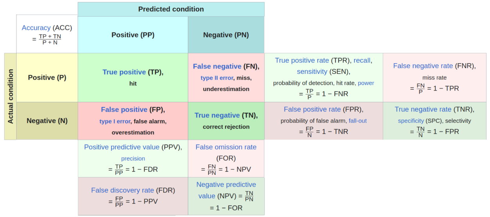

# 541 Lab 4 - Bias and fairness

## Required readings

We covered some of these videos during lecture, but I'm including them here so that you have everything in one place. There might be questions on specifics from the required readings whereas the optional readings are more of a general help or for your own interest.

- Arvind Narayanan ["Tutorial: 21 fairness definitions and their politics "](https://www.youtube.com/watch?v=jIXIuYdnyyk) 12:54 - 18:03
- [The notebook for q2.3](https://github.ubc.ca/mds-2025-26/DSCI_541_priv-eth-sec_students/blob/master/assessing_and_mitigating_bias.ipynb). Please read through the text and review the output plots of this notebook before the lab, so that you are ready to discuss it.
- [Step by step explanation of a confusion matrix](https://ubcca-my.sharepoint.com/:v:/g/personal/tiffany_timbers_ubc_ca/ETkcUTRv1LdFvMvyxfLb410BEHPYijwh5AChiPemKMK06w?e=x3YslB) (25 min clip, from last year, you can skip through if you understand the concepts already)

## Optional readings

<details><summary>Click to show</summary>

- [This clip from the CBS series "The Good Wife" ](https://www.coursera.org/lecture/data-science-ethics/case-study-your-safety-is-my-lost-income-GM3a0)
- [Interview with Cathy O'Neil (data scientists, author "Weapons of math destruction")](https://www.youtube.com/watch?v=CglwuYH9hgA) on fairness and auditing with interesting real-world examples.
- [Conversation between Lex Fridman (computer scientist, ex-googler) and Michael Kearns (CS prof at UofPennsylvania, author "The ethical algorithm")
  ](https://www.youtube.com/watch?v=AzdxbzHtjgs) about most of the topics we covered in 541, very interesting!
- [Case studies of how ML fairness criteria could be applied in a health care setting.
](https://www.ncbi.nlm.nih.gov/pmc/articles/PMC6594166/). An interesting meta-fairness aspect is that [there are many regions not yet participating in the discussion around AI/ML fairness practices](https://www.nature.com/articles/s42256-019-0088-2) and it is possible that there are cultural differences in which practices are seen as the most important, so this will be an interesting discussion to follow in the future (as we saw in the very first lesson on self-driving cars).
</details>

## Submission instructions

rubric={mechanics:20}

<div class="alert alert-info">
<p>You receive marks for submitting your lab correctly, please follow these instructions:</p>

<ul>
  <li><a href="https://ubc-mds.github.io/resources_pages/general_lab_instructions/">
      Follow the general lab instructions.</a></li>
  <li><a href="https://github.com/UBC-MDS/public/tree/master/rubric">
      Click here to view a description of the rubrics used to grade the questions</a></li>
  <li>Push your <code>.ipynb</code> file to your GitHub repository for this lab (make at least three commits).</li>
  <li>Upload your <code>.ipynb</code> file to Gradescope.
  </li>
  <li>Include a clickable link to your GitHub repo for the lab just below this cell
    <ul>
      <li>It should look something like this https://github.ubc.ca/MDS-2025-26/DSCI_541_labX_yourcwl.</li>
      <li>If you are working in a group, you can create you own (public) repo in <a href="https://github.ubc.ca/MDS-2023-24"> the UBC-MDS organization</a> and link that instead.</li>
    </ul>
  </li>
<li>All your written answers must be in your own words.</li>
<li>You are not allowed to use generative AI tools to write your answers for you or simply paraphrase answer that you generate from these tools (that will lead to a failing grade), but you can use them to further understand the topics you are learning about.</li>
 
</ul>
</div>

YOUR LINK HERE

## Overall writing quality

rubric={writing:20}

<div class="alert alert-info">

<p>You will receive an overall writing grade for the entire lab instead of for each question. This is just a small part of your total grade, but please use the Jupyter Lab spell checker extension to catch typos and read through your text for grammatical errors before submitting (or paste it into Google Docs/MS Word/Grammarly. You don't need to type anything under this cell, it is just a placeholder to generate the grading rubric.</p>
    
</div>

# 1. Short answer questions

**No short answer questions this week.** Your knowledge of the material will be incorporated in the discussion questions instead, particularly the last question which is a bit longer.

# 2. Discussion questions

This section asks you to expand a bit on your reasoning, but still aim to write succinct replies around one paragraph per sub-question. The goal of lab discussions are not to provide you with the right answers, but to help your discussion along. Your TA will assist in this by bringing up topics that you might not have thought of, ask questions to break the silence or a dead end, and move the conversation along so that you have time to go through most questions. How useful the lab discussion is for your submission ultimately relies on that you actively contribute to the discussion and help your peers contribute and exchange ideas.

## Some tips to make your discussions in lab more effective

It is easy to overlook the flaws of our own reasoning,
so having a discussion with colleagues is an excellent opportunity
to develop your thinking and receive feedback
from someone who can provide an alternative perspective from your own.
Nevertheless,
many people don't know how to have an effective discussion,
so I am sharing a few tips for you to be able to make the most out of this opportunity:

- Commit to learning, not "winning" debates.
- Comment in order to share information and develop arguments further, not to persuade.
- Listen respectfully, without interrupting, to try to understand each others' views.
  - Don't focus on what you are going to say next while someone else is talking.
- Challenge ideas, not individuals.
  - And be open to having your own ideas challenged.
- Think about as good arguments as possible against your position.
  - This is especially useful if many of your peers have the same opinion, help your group find angles that you might otherwise be missing.
- Allow everyone the chance to speak.
  - Politely ask members of your group about their opinion.
- Avoid assumptions about any member of the class or generalizations about social groups.
  - Be careful about asking individuals to speak on the behalf of their (perceived) social group.
- Be aware of [logical fallacies](https://blog.hubspot.com/marketing/common-logical-fallacies), but avoid pointing them out in rude or disrespectful ways.

---

You can use this confusion matrix from the lecture to help guide your reasoning on the discussion questions:



## Question 2.1 -- Stakeholders and error rates in a lending scenario

rubric={reasoning:100}

<div class="alert alert-info">

<ol type="1">
<li>A bank is building a model to predict which clients to approve for loans and which to refuse a loan. The positive class represents those predicted to be suitable loan applicants and should ideally contain all people who are actually able to pay back the loan. The negative class represents those predicted to default and should ideally include all people who are not able to back the loan). Explain what each of True Positive (TP), True Negative (TN), False Positive (FP), and False Negative (FN) correspond to in this scenario.</li>
<li>Who are the stakeholders in this situation and what real-world consequences will they experiene from the each type of error (FP and FN) that the model might make?</li>
</ol>
   
</div>

OUTLINE SUBMITTED BY THE END OF THE LAB (if applicable): Peter

1. True Positive: correctly identifying people who can pay back the loan
   False Positive: approving applicants who will default on a loan
   True Negative: correctly rejecting applications who will default
   False Negative: rejecting applicants who would've been able to pay the loan back

2.

- the bank: larger loss on the FP, losing money to applicants who cannot pay it back
- FN: reduced reputation and loss of potential money from interest

- the applicants: equal consequences for FP and FN
- FP: applicants get approved for a loan they can't pay back, which can lead to financial hardship and affect their credit score.

- employee in charge of approving the credit loans (three main stakeholders): could get in trouble/fired for directly approving False Positives, especially with larger loans - larger consequence for a FP than a FN

- society at large: have a stake in overall loan rate and who gets approved for a loan
- economy and such

FINAL OUTLINE

1.

2.

YOUR ANSWERS HERE

1.

2.

## Question 2.2 -- Quantifying fairness in a lending scenario

rubric={reasoning:100}

<div class="alert alert-info">

<ol type="1">
<li>Which fairness criteria (independence, separation, or sufficiency) would you recommend that the bank uses to balance its model predictions between groups in order to prevent disparate real-world harm while being fair to qualified applicants from the different groups? Explain why you picked the one(s) you did and if there are any downsides with only focusing on that one. Also give an example of a fairness metric that satisfies this criteria (e.g. demographic parity, equal odds, equal opportunity, positive/negative predictive value).</li>
<li>Imagine that this algorithm is put into practice at a bank. How can we review that the algorithm is doing a good job after it is implemented? Which data will we have access to when evaluating/reviewing how the algorithm is doing? Think about which of TP, FP, TN, FN you will be able to investigate and give an example of something you could change to be able investigate more types of errors.</li>
</ol>

</div>

OUTLINE SUBMITTED BY THE END OF THE LAB (if applicable) Zhihao

1. Separation: equal opportunity/equal odds; equalizes error rates across both groups
   pros: ensures fairness for applicants while balancing some predictive accuracy

- Would prevent inadvertent discrimination by the model against certain demographic groups.
  cons: may not optimize for most accurate/best outcome for the banks

If thinking about the banks: sufficiency would be the best criteria, but would preserve historical bias

2. Stratify data by demographic characteristics, evaluate for all the error metrics

- have access to historical and current loan data (stratifying controls for any demographic bias present in historical data)
- we would be able to assess three of the four error metrics (False Positives may be harder, given loan timelines), False Negatives cannot be evaluated directly as we would not be able to tell if a rejected applicant would have paid the loan back
- in order to evaluate more metrics, the banks can give loans to applicants that are deemed riskier (acceptable risk band, randomly select within that) to assess metrics like False Negatives.
- this will bias the outcome to some degree as it is not total random selection

FINAL OUTLINE

1.

2.

YOUR ANSWERS HERE

1.

2.

## Question 2.3 -- Assessing and mitigating unfairness

rubric={reasoning:100}

In the student repo, I have a uploaded a notebook from a principal ML specialist at DataBricks (linked under the required reading section at the top), which was presented as a demonstration for how to incorporate fairness considerations in an ML context on a conference recently. The notebook contains an analysis of a model trained on the data that Propublica acquired to investigate the COMPAS algorithm's treatment of African American defendants. You do not need to understand the code anywhere in the notebook to answer these questions and you are not meant to run the notebook, just study the outputs and the claims from the author (but the code is in the notebook if you are interested to learn more about it).

In an attempt to make this more like a real-life scenario, I have not cleaned up this notebook too much, although I have made some edits. From the lectures, you know of the necessary concepts to answer these questions and I think that this is good practice in reviewing/auditing a colleague's analysis while focusing on understanding the outputs although you might not understand everything the code does or have used every single package your colleague used (which often is the scenario you will find yourself in at work).

> Note: In terms of fairness-related libraries, the author uses SHAP to try to understand which features has a large impact on model performance. You learned about SHAP in DSCI 573, so revisit those lecture notes if you need a refresher. Another fairness library used here is [FairLearn](https://fairlearn.org/main/user_guide/index.html#user-guide) from Microsoft, which is useful both for visualizing fairness metrics and to constrain the model training/outputs based on a criteria of fairness between groups, rather than just a metric like overall accuracy that improves overall performance. You don't need to understand how to use this library to answer the questions in this notebook. I should also note that this notebook is not representative of DataBricks position on fairness or used in production anywhere at the company, but they provide good discussion material.

Enough preamble, let's get started!

<div class="alert alert-info">

<p>The notebook author suggests four fairness approaches (A, B, C, and D below) which all have different implications for how the algorithm treats black and white defendants. Reflect on the output from the four approaches and answer the questions below:</p>
<p>A. <strong>Do nothing</strong></p>
<p>This is the baseline model in the notebook. Review the confusion matrices and the tables of fairness metrics presented in the notebook. Discuss these specific questions:</p>
<ol type="1">
<li>In the notebook, the ouput is reported as both a confusion matrix (via <code>show_confusion_matrix_diff()</code>) and a table(via <code>show_fairness_metrics()</code>). Let's start by understanding the table. There seems to be some metrics that are exactly zero and some that are identical (e.g. accuracy, recall, and selection rate for the last row). We also see a few warnings about there being no true samples. What is the reason that we see these warnings and that identical (and zero) values are present in the table?</li>
<blockquote>
<p>Note that <code>selection_rate</code> is the prediction probability for an individual from either group without conditioning on the outcome (i.e. regardless of their actual recidivism), so it relates to demographic parity which we discussed in lecture</p>
</blockquote>
<li>Which of the reported fairness metrics in the table in the notebook could we derive from the confusion matrix and how? Hint: Think about how the confusion matrix is normalized.</li>
<li>The “Difference” confusing matrix in purple is an interesting and potentially helpful idea. But what does it really tell us? If we look at the False Positives (upper right quadrant), it seems from the purple confusion matrix that the difference is just 11% but when we look at the FPR in the fairness metric table, the rate is 20 percentage points and about twice as large for the African American defendants; what is going on here?</li>
<li>What do you think of the choice of fairness metrics in the table? Is there any metric missing that you think could have been useful to include? Is any of the included metrics unnecessary and could have been removed? Hint: Which metric did Northpointe argue was what they used to calibrate the COMPAS scores internally (covered during lecture)?</li>
</ol>
<hr />
<p>B. <strong>Remove demographic features</strong></p>
<ol type="1">
<li><p>Based on the confusion matrices, does it seem like this is a useful strategy to mitigate disparate impact? Why do you think that is (or is not) the case?</p></li>
<li><p>Under “A word about interpretation” the author writes:</p>
<blockquote>
<p>Data isn’t perfect either. It could have errors or misrepresent reality. Data can encode bias from the real world. Remember in particular that this data set does not tell us whether the defendant committed another crime; it tells us whether they were arrested again. The model is, in effect, predicting something about recidivism but also about how and when people are arrested and charged, which are not the same thing.</p>
</blockquote>
<p>Why is it important to distinguish arrests from recidivism? Give a specific example of how failing to make this distinction could lead to unfairness in this scenario.</p></li>
</ol>
<hr />
<p>C. <strong>Post-process the model results with a fairness constraint</strong></p>
<p>Here, the prediction probabilities are post-processed to include different thresholds for the two groups in order to meet the equalized odds fairness criteria. Study the results (confusion matrix/fairness metrics) and reflect on what are the advantages and disadvantages of using this approach. You don’t necessarily have to have a conclusion on whether you think it is worth it or not in this scenario (especially as we are lacking important context and additional information), but make sure that you reflect on a few of the main pros and cons from the perspective of different stakeholders. One of the last slides in lectures 7 includes a similar example with credit card scores.</p>
<hr />
<p>D. <strong>Correct for Bias with SHAP Values</strong></p>
<p>In B, the author used SHAP values to analyze which features had a big impact on the model prediction. In this section, they suggests that we can use this information to remove the impact of the sensitive feature on the prediction. They conclude that:</p>
<blockquote>
<p>The results in this case are somewhere in between the last two experiments – no demographic information, and Fairlearn post-processing. This approach does not achieve equalized odds, though the parity gap is a few percentage points smaller. Accuracy stays higher compared to the Fairlearn approach however.</p>
</blockquote>
<p>Study the results and compare them to the three previous approaches. Write about which parts of the author’s conclusion you agree and disagree with and motivate why. Does it seem like this approach of using SHAP values to reduce the impact of the sensitive feature on the prediction was effective in this particular case? Explain why / why not.</p>

</div>

OUTLINE SUBMITTED BY THE END OF THE LAB (if applicable)

A. Sean

- zero recall and FN for predicting no recidivism because they did not predict non-recidivism, they focused on predicted recidivism positive classes
- we can calculate all of them, based on the above confusion matrix diagram, given that we have all of FP, TP, FN, TN
- The FPR is twice as large in the fairness metric table because it is normalized by the total number of actual negatives, versus the confusion matrix, which is normalized by the total number of samples.

- take out recall (equal to accuracy or 0)

B. Daniel

- did not seem to chance the outcome much compared to strategy A, not helpful; confounders and the 'effect of race' on other predictors are still present

- arrests do not necessarily mean a crime was actually committed, could be a mistaken identity or wrongful arrest

C. Victoria
pro: can reduce racial bias effects in data and ensures a more equalized outcome

- balancing TP and FP rates so that each group has comparable rates
  cons: may sacrifice predictive quality and accuracy
- may artifically create another type of unfairness

D. Victoria
potential interaction effects being ignored, now we are correcting just for individual feature effects

- agree that this is probably the 'best' method when balancing accuracy and fairness with this dataset
- may end up overcorrecting, in this case accuracy did stay high, but it is possible to compound bias corrections when features may have related effects
- does not control for other confounders

FINAL OUTLINE

A.

B.

C.

D.

YOUR ANSWERS HERE

A. 

1. The reason that zeros and warnings are in the fairness metric table is because we are seperating the data into four group. These are African American defendants who recidivated, African American defendants who did not recidivate, white defendants who recidivated, and white defendants who did not recidivate. Therefore, for the groups where the positive class does not exist (those who did not recidivate), the recall is zero since there are no true positives (which will also raise a warning). It is the opposite for the groups that did recidivate, where the false positive rate is zero because negatives are not included.

2. All of the fairness metrics can be derived from the confusion matrix, as we are given values for TP, FP, TN and FN. As long as we have these basics metrics and we know the proportion of subjects in each class, we can calculate all of the fairness metrics. For example, FPR is FP / (FP + TN) and FDR is FP / (FP + TP).

3. The confusion matrix is normalized by the number of samples in each demographic group. On the other hand, each row in the fairness metric table is normalized by the demographic group and the outcome (recidivism or not). Therefore, the FPR difference in the confusion matrix will not be the same as the FPR difference in the fairness metric table. The fairness metric table's FPR is conditioned only on actual non-recidivists, while the confusion matrix's FPR is conditioned on the total number of samples.

4. We believe that the choice of fairness metrics is good, as it includes equalized odds, sufficiency, and independence metrics. However, we also feel that including the Predictive Parity metric would have been useful (used by Northpointe), which looks at the proportion of defendents that re-offended among those with similar scores.  A metric we feel may be unnecessary is Accuracy, as it is less informative, can be misleading, and does not capture group disparities.


B.

C. This approach involves optimizing decision thresholds after the model has made its predictions to ensure the two demographic groups have equal error rates.

Pros: reduces between-group disparities

> - any explicitly harmful bias (like the direct critique that African-Americans have unfairly high FP rates) is reduced
> - mathematically equal outcome is guaranteed, by forcing the TP and FP rates to be equal across the groups

Cons: accuracy-fairness trade-off and creates artificial unfairness

> - the model is no longer optimizing JUST for accuracy, so other performance metrics like Recall may drop
> - the model becomes 'worse' for the sake of being fair
> - this method of equalizing degrades accuracy for the priviliged group instead of increasing accuracy for the disadvantaged group, which may serve to create a different kind of unfairness for individuals

Stakeholder Perspectives:

1. The Justice System (Prosecutors, DAs, Judges)

- the largest tensions here are between liability, constitutional rights, and public safety
- with the reduction in disparities, the defensibility of court decisions increases and standardizing this error management can increase reliability or predictability of the algorithm
- however, specifically selecting for race as a method of controlling bias is generally not allowed constitutionally and the overall drop in accuracy may render this useless as a tool

2. The accused

- there may be direct relief for those coming from disadvantaged groups, as biases that go against them are being corrected for
- however, the creation of a false unfairness for individuals from the advantaged groups is causing another kind of harm that may also need to be corrected for
- overall, there is a lack of transparency and correcting scores post-prediction can only serve to add to this confusion

3. Society at large

- mitigates the feedback loop of racial inequality that is present in many societal systems
- can restore public faith and trust in criminal case decisions, especially from disadvantaged groups
- however, sacrificing accuracy for fairness can put overall public safety at risk
- correcting for race does not address underlying confounders or effects of a racist system that trained the biased model to begin with

D. This approach directly integrates fairness-centered constaints into the model's training process so that it is learned throughout. Although there are some cons, we generally agreed this was the best method and the SHAP usage was effective in this particular case.

Pros: optimal fairness-accuracy tradeoff (thus far)

> - out of all listed methods, this one seems to be the most robust and balanced approach for both fairness and accuracy
> - overall accuracy and other performance metrics kept high while mitigating bias

Cons: interaction effects, confounders, and overcorrection

> - any nuanced interaction effects (intersectionality) is ignored by correcting for features one at a time
> - correcting for single marginal effects does not account for intersectional bias (such as race interacting with age)
> - although accuracy stayed high in this case, there is a risk of overcorrecting with the balancing and sacrificing accuracy by penalizing sensitive, highly correlated features
> - there may be other confounder variables or 'invisible' effects that are not being controlled for within this model, such as historical data (e.g. previous arrests) that is already filled with bias

## Question 2.4 (Challenging)

rubric={reasoning:20}

These questions continue the discussion of the same notebook referenced in the previous question.

<div class="alert alert-warning">

<ol type="1">
<li>The author of the notebook in 2.3 refers to <a href="https://shap.readthedocs.io/en/latest/example_notebooks/overviews/Explaining%20quantitative%20measures%20of%20fairness.html#How-introducing-a-protected-feature-can-help-distinguish-between-label-bias-and-feature-bias">this section of SHAP documentation</a> as part of their explanation for how SHAP values can be used to mitigate the impact of a sensitive features on the model prediction. However, there is something shown in this section of the docs that is lacking from the notebook. What is it and why would this have been a key component to include to support the author’s claims that SHAP can be used to mitigate disparate impact in the case of recidivism?</li>
<li>In 2.3 you might have been itching to dive into the data and explore it yourself. Well it’s your lucky day because <a href="https://github.com/propublica/compas-analysis/blob/master/compas.db">you can download it from ProPublica's GitHub</a>! Load the data in the cell below and perform an analysis of your choice that either lends support to your reflections in 2.3 or highlights another important aspect of the data that you think we should consider when making a fairness assessment of the model in 2.3 (this can be short and you can be creative, but make sure to include a paragraph explaining what your analysis shows and why it matters).</li>
</ol>

</div>

```python

```

YOUR ANSWERS HERE

1.

2.

---

# Help us improve the labs

The MDS program is continually looking to improve our courses, including lab questions and content. The following optional questions will not affect your grade in any way nor will they be used for anything other than program improvement:

1. Approximately how many hours did you spend working or thinking about this assignment (including lab time)?

#Ans:

2. Were there any questions that you particularly liked or disliked?

#Ans: [Questions you liked]

#Ans: [Questions you disliked]
